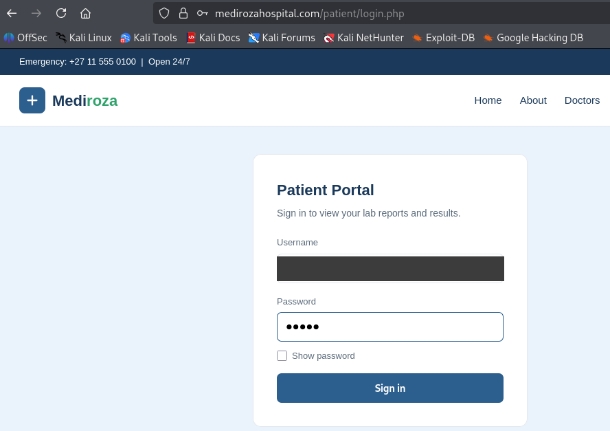
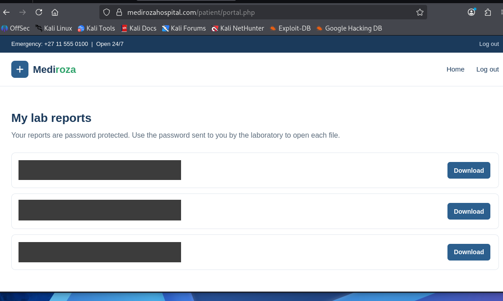
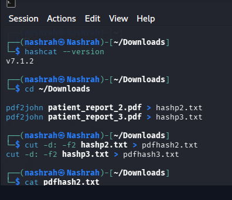
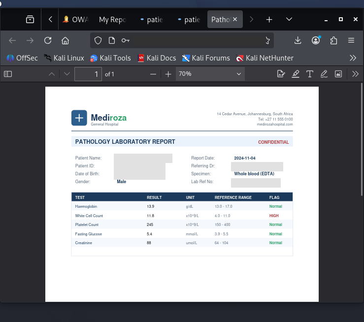
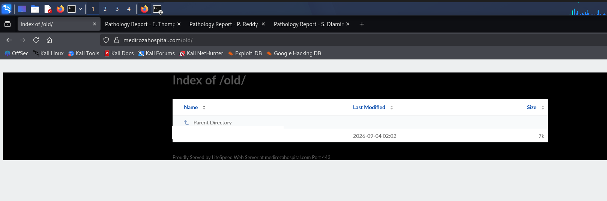

<div align="center">

<table>
<tr><td colspan="2" align="center"><b>NETWORKWALKS &nbsp;|&nbsp; CONFIDENTIAL TRAINING ENGAGEMENT</b></td></tr>
</table>

# Mediroza General Hospital
### Black-Box Penetration Test Report

<table>
<tr><td><b>Program</b></td><td>Networkwalks Penetration Testing Training Program</td></tr>
<tr><td><b>Batch</b></td><td>B082 - Week 4</td></tr>
<tr><td><b>Prepared By</b></td><td>Nashra</td></tr>
<tr><td><b>Mentor</b></td><td>Waqas Karim, CCIE</td></tr>
<tr><td><b>Client</b></td><td>Mediroza General Hospital</td></tr>
<tr><td><b>Target</b></td><td><code>https://medirozahospital.com</code></td></tr>
<tr><td><b>Engagement Type</b></td><td>Full Black-Box Penetration Test</td></tr>
<tr><td><b>Duration</b></td><td>3 Days</td></tr>
<tr><td><b>Status</b></td><td>Final - All Milestones Completed</td></tr>
</table>

</div>

---

> **Disclaimer:** This assessment was carried out in a controlled training environment against a system for which explicit written authorisation was granted. None of the techniques documented here were, or should be, applied to any system without equivalent written permission from the owner. This repository is shared for educational and portfolio purposes only. Exact payloads, credentials, and step-by-step exploitation details have intentionally been left out, since this exercise is still being worked through by other trainees.

---

## 1. Overview

This repository documents an authorised penetration test against a hospital web application built for training purposes. The goal was to identify real, exploitable vulnerabilities in the patient-facing portal and supporting infrastructure, chain them together to demonstrate genuine business impact, and produce a client-ready report to the same standard expected of a paid engagement.

At a high level, the assessment found that a flaw in the patient login mechanism allowed authentication to be bypassed, which exposed lab reports belonging to multiple patients. Those documents were protected by weak passwords, and metadata left inside one of the recovered files pointed to an additional, unrelated exposure on the server that revealed internal staff and ownership records.

## 2. Scope and Rules of Engagement

| Item | Detail |
|---|---|
| Target | `https://medirozahospital.com` |
| Engagement type | Full black-box test, no credentials or internal documentation provided |
| Rules | Testing limited to the target domain only. No social engineering. No denial-of-service testing. No testing outside the agreed scope. |
| Authorisation | Written authorisation provided prior to testing |

## 3. Milestones

| # | Milestone | Objective |
|---|---|---|
| M1 | Initial Access | Gain access to the patient portal and retrieve confidential lab reports |
| M2 | Data Extraction | Recover the contents of the protected documents obtained in M1 |
| M3 | Critical Exposure | Identify further server-side data exposure affecting staff and ownership records |
| M4 | Reporting | Produce a professional penetration testing report for the client |

## 4. Methodology and Tools

The assessment followed a standard black-box methodology: reconnaissance, manual testing of application logic, exploitation, and post-exploitation analysis.

- Manual reconnaissance of login pages and application structure
- Manual testing of authentication input handling
- Browser developer tools, for inspecting requests and responses
- `qpdf`, for inspecting and decrypting protected PDF documents
- `pdf2john` and `hashcat`, for offline recovery of document protection where required
- `exiftool` and `pdfinfo`, for metadata analysis of recovered documents
- `pdftotext`, for extracting readable content
- `curl` and `wget`, for manual enumeration of server resources
- Standard command-line text processing utilities, for reviewing recovered data

## 5. Findings Summary

| ID | Finding | Risk |
|---|---|---|
| F1 | Authentication bypass in the patient portal login |  |
| F2 | Broken access control, cross-patient data exposure |  |
| F3 | Weak protection on distributed patient documents |  |
| F4 | Sensitive information disclosure via document metadata |  |
| F5 | Unauthenticated exposure of a server-side backup resource |  |
| F6 | Disclosure of confidential HR and ownership records |  |

### F1: Authentication Bypass, Patient Portal (Critical)
The login form on the patient portal did not properly validate or sanitise user-supplied input before using it in a backend query, allowing the authentication check to be bypassed without valid credentials.

<p align="center">
<br>
<sub><i>Figure 1: Patient portal login form after a successful authentication bypass. The submitted value has been redacted.</i></sub>
</p>

### F2: Broken Access Control, Cross-Patient Data Exposure (High)
Once past authentication, the portal returned lab reports belonging to multiple, unrelated patients rather than scoping results to a single verified identity, confirming an absence of server-side authorisation checks.

<p align="center">
<br>
<sub><i>Figure 2: The portal returning reports for multiple unrelated patients. Names and reference numbers have been redacted.</i></sub>
</p>

### F3: Weak Protection on Distributed Patient Documents (High)
The documents retrieved from the portal were protected, but the protection could be defeated in a short time using standard offline recovery techniques and common wordlists.

<p align="center">
<br>
<sub><i>Figure 3: Offline recovery tooling used to defeat document protection. Recovered hash values have been redacted.</i></sub>
</p>

### F4: Sensitive Information Disclosure via Document Metadata (Medium)
Reviewing the metadata of a recovered document revealed an internal note left behind by hospital IT staff. This detail was not intended for external distribution and pointed toward a further exposure on the server, which was investigated and confirmed as F5.

<p align="center">
<br>
<sub><i>Figure 4: A successfully decrypted lab report. Patient-identifying fields have been redacted.</i></sub>
</p>

### F5: Directory Listing Enabled, Exposed Database Backup (Critical)
A legacy directory on the webserver was found to have directory listing enabled, exposing a database backup file that could be downloaded without any authentication.

<p align="center">
<br>
<sub><i>Figure 5: An unauthenticated directory listing exposing a legacy database backup. The exact filename has been redacted.</i></sub>
</p>

### F6: Confidential HR & Shareholder Data Exposure (Critical)
The recovered backup contained a full staff records table (names, national identification numbers, salaries, and contact details) and a shareholder register (ownership percentages and share classes) for the entire organisation. This is the most severe finding of the engagement.

## 6. Attack Chain (High-Level)

```
Patient login form
        |  Authentication logic flaw
        v
Login bypassed -> access to patient portal
        |  No server-side authorisation check
        v
Multiple patients' confidential documents retrieved
        |  Weak document protection defeated offline
        v
Document contents recovered
        |  Internal note found in document metadata
        v
Additional server resource identified and found unprotected
        |  Unauthenticated download
        v
Internal backup file retrieved
        |
        v
Staff records and shareholder register exposed
```

## 7. Recommendations

- Use parameterised queries for all database interactions; never build queries by concatenating user input.
- Enforce server-side authorisation on every record request, scoped to the authenticated user's own identity.
- Apply strong, unique, randomly generated protection to any document containing personal or medical information.
- Strip author, comment, and other internal metadata from documents before they are distributed externally.
- Disable directory listing on the webserver and ensure backup files are never stored inside the public web root.
- Review breach notification obligations given the exposure of national identification numbers and health-related information.

Full detail, impact analysis, and remediation guidance for each finding is available in the complete report.

## 8. Repository Contents

```
```

*(Raw recovered documents, the database backup, and unredacted staff or shareholder data are withheld from this public repository and were provided to the client and instructor separately, in line with responsible handling of sensitive data.)*

## 9. Skills Demonstrated

<p align="center">


<br><br>


<br><br>


</p>

---

<div align="center">

## Thank You

**Prepared by Nashra**
**Mentor: Waqas Karim, CCIE**
Networkwalks Batch B082 - Week 4

LinkedIn: www.linkedin.com/in/nashrah-bashir

Target: `https://medirozahospital.com`

*This project was completed as part of the Networkwalks penetration testing training program, Batch B082.*

</div>
